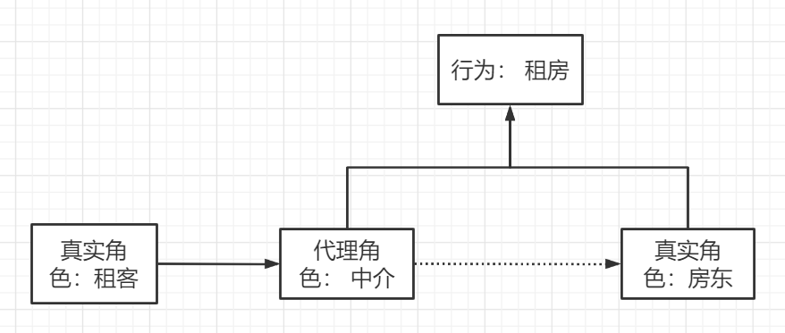

# 静态代理

## 架构图：

## 角色分析

- 抽象角色(共同完成某件事情): 一般会使用接口或者抽象类来解决
- 真实角色: 被代理的角色 (房东)
- 代理角色: 代理真实的角色 (代理房东)， 代理真实角色后我们一般都会进行一些附属操作
- 客户: 访问代理对象的人(租客)

## 代理模式的好处

- 更好地实现单一职责原则, 真实角色可以更纯粹, 不需要关注公共业务
- 公共业务交给代理角色实现, 分工更明确
- 公共业务发生改变时, 扩展更集中、更容易

## 缺点
- 一个真实角色就会产生一个代理角色, 代码量翻倍, 开发效率降低

## 步骤

1. 接口 (`Rent.class`)
2. 真实角色 (`Landlord.class`)
3. 代理角色 (`Proxy.class`)
4. 客户端访问 (`Client.class`)
